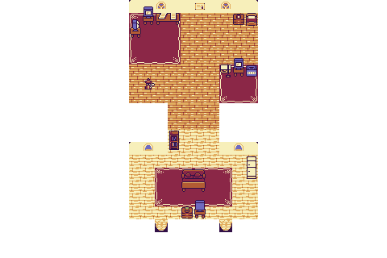

# James Sudimak - Interactive 2D Portfolio

This is an interactive "game" portfolio built using [Kaboom JS](https://kaboomjs.com/) and [Tiled](https://www.mapeditor.org/).

It is based on [this project](https://github.com/JSLegendDev/2d-portfolio-kaboom) created by JSLegendDev.